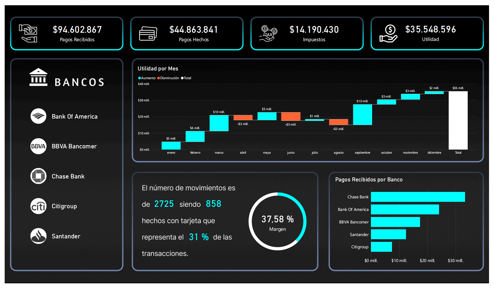
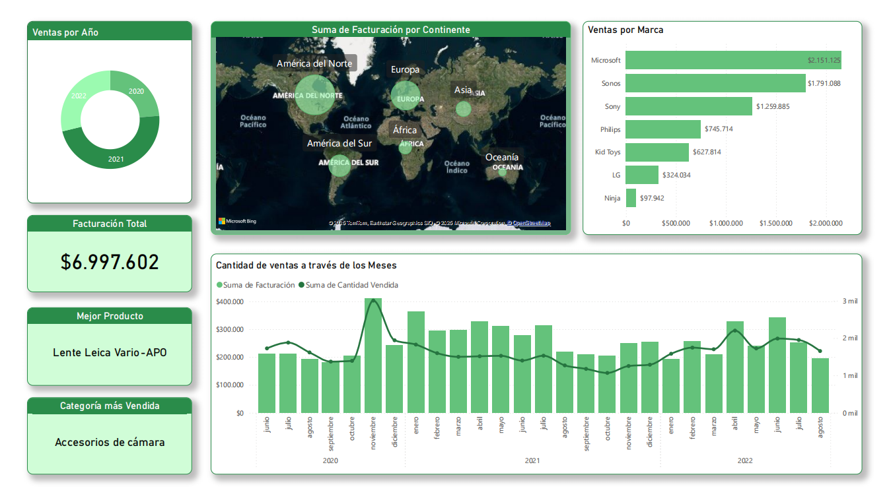
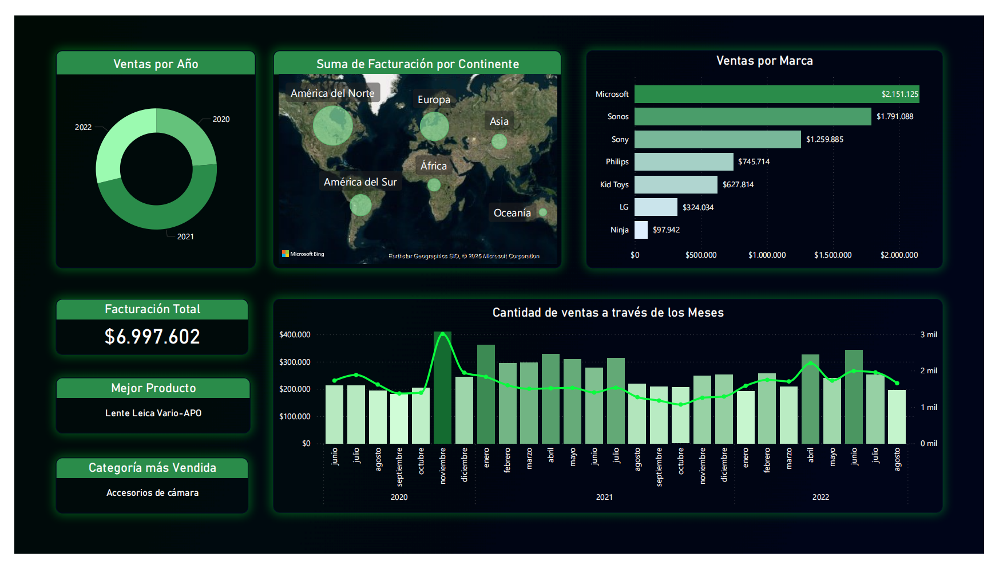
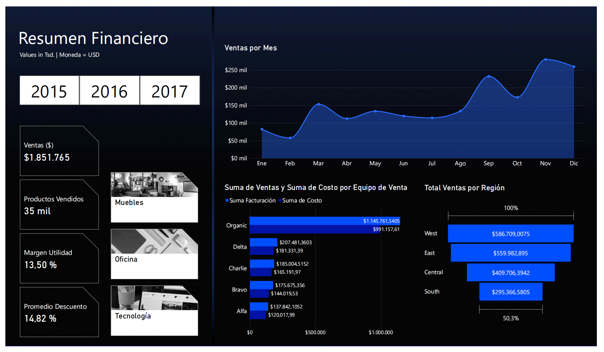
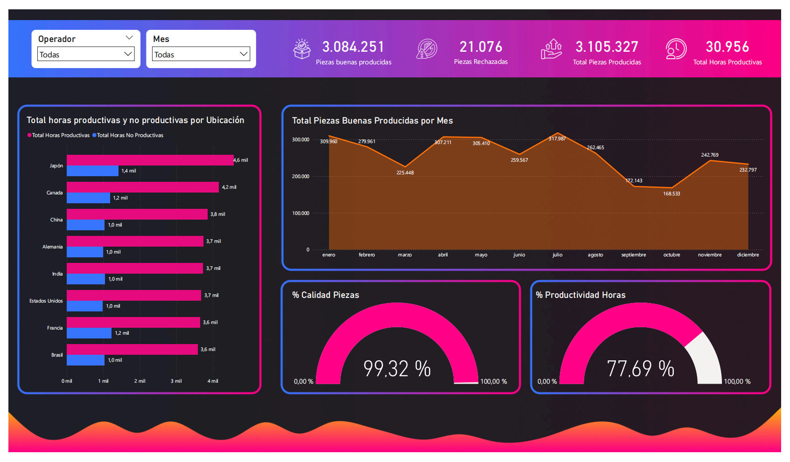
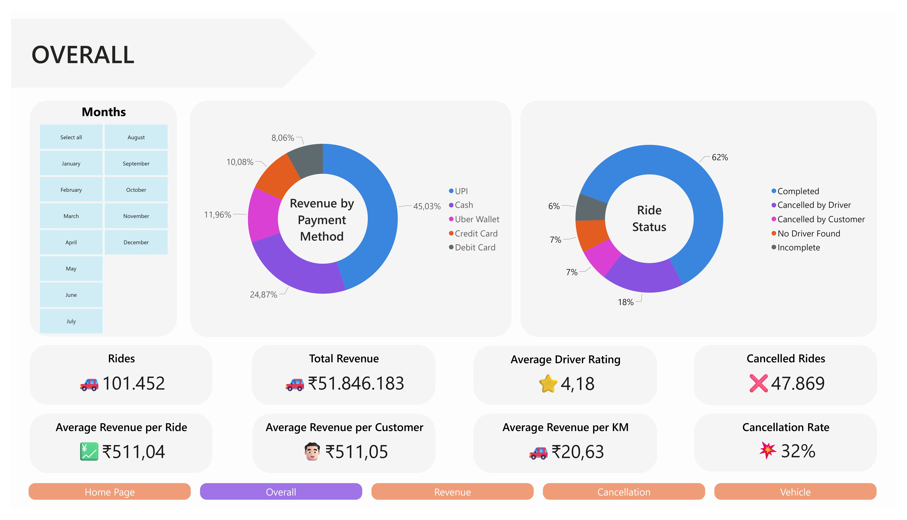

# 📁 Power BI Projects

Repositorio que reúne **proyectos desarrollados en Power BI**, organizados por cursos, pasantías, prácticas profesionales y personales.  
Cada carpeta contiene dashboards completos, datasets ficticios, medidas DAX, transformaciones en Power Query y documentación detallada.

 

## Estructura general del repositorio

**Semana Power BI**
<table>
  <tr>
    <td align="center">
      
Ventas Dark

      
    </td>
    <td align="center">
      
Ventas Light

      
    </td>
    <td align="center">
      
Bancario

      
    </td>
    <td align="center">
      
Financiero

      
    </td>
    <td align="center">
      
Productividad

      
    </td>
  </tr>
</table>

**Artech Power BI**
<table>
  <tr>
    <td align="center">
      
Transporte

      
    </td>
  </tr>
</table>

 

## 📌 Propósito del repositorio

El objetivo de este repositorio es **documentar mi progreso y práctica profesional en el uso de Power BI**, integrando análisis visual, modelado de datos y diseño UI/UX.  

Cada carpeta contiene:
- Un archivo `.pbix` con el dashboard principal.  
- Una carpeta `images/` o `Vistas/` con capturas del resultado final.  
- Un `README.md` con explicación detallada del caso, los KPIs creados y las transformaciones aplicadas.  

 

## 🧰 Tecnologías y habilidades aplicadas

- **Power BI Desktop**.  
- **Power Query**.  
- **DAX (Data Analysis Expressions)**.  
- **Modelado de datos**.  
- **Figma**.  
- **Excel**.
- **CSV**.  

 

## Créditos 

- Los dashboards fueron diseñados, desarrollados y documentados íntegramente por **Maria Monchot**, con fines de aprendizaje y demostración de habilidades analíticas y de visualización en Power BI.  
- ✅ El uso de los archivos Excel y CSV es totalmente abierto al público y se pueden utilizar.
- 🚫 No se consciente la copia o réplica de ninguno de estos dashboards.

 
